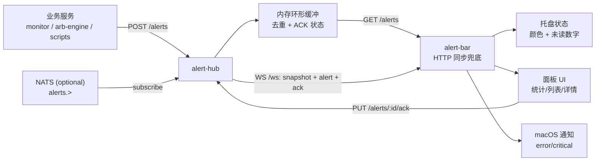
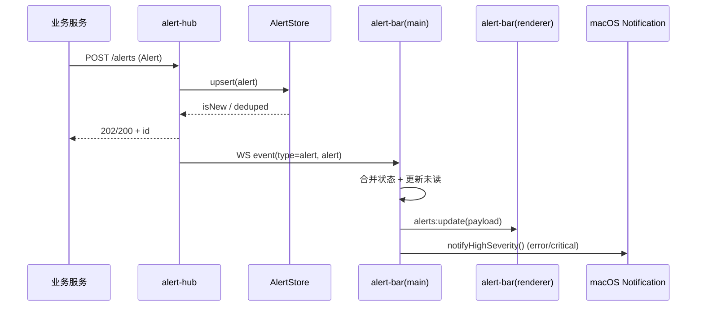
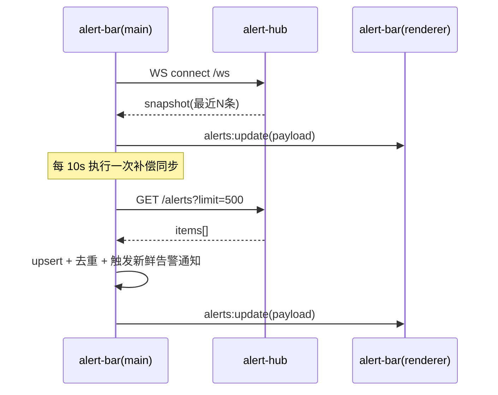
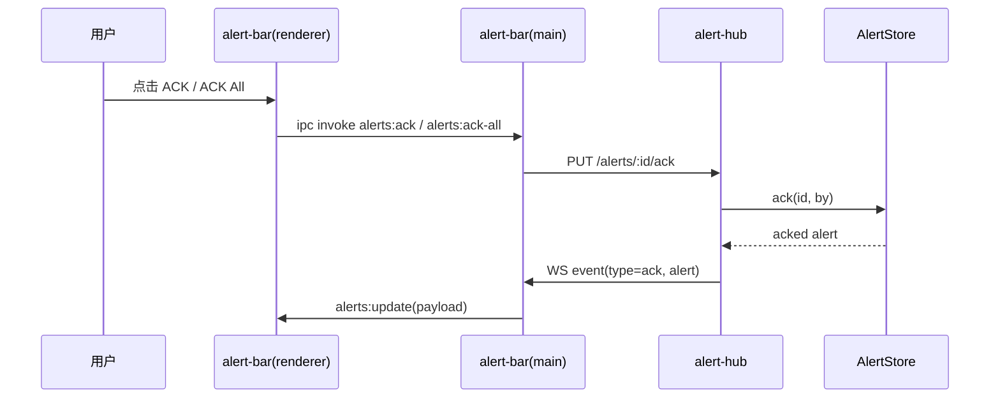

# Alert System 数据流说明

本文档描述当前 `alert-sdk` + `alert-hub` + `alert-bar` 的端到端数据流、关键接口、状态变化与扩展点。

## 1. 组件与职责

- `sdks/alert-sdk`
  - 统一 `Alert` 数据结构
  - 负责生成 `id / ts / ts_ms`
  - 通过 HTTP `POST /alerts` fire-and-forget 推送
- `apps/alert-hub`
  - 接收告警（HTTP / 可选 NATS）
  - 写入内存环形缓冲（默认 500）
  - 通过 WebSocket `/ws` 广播给所有客户端
  - 提供查询与确认（ACK）接口
- `apps/alert-bar`
  - WebSocket 实时订阅
  - 定时 HTTP 同步兜底（防丢）
  - 托盘未读计数、严重级别颜色
  - `error/critical` 通知与弹窗
  - 面板展示统计、关键告警、明细与 ACK 操作

## 2. 总体数据流图



## 3. 实时链路时序图



## 4. 首次加载与补偿同步



## 5. ACK 回路



## 6. Alert 数据模型（当前实现）

```ts
type AlertSeverity = "info" | "warn" | "error" | "critical";

interface Alert {
  id: string;
  ts: string;
  ts_ms: number;
  severity: AlertSeverity;
  source: string;
  title: string;
  body?: string;
  meta?: Record<string, unknown>;
  group?: string;
}
```

`alert-hub` 内部在此基础上附加：

```ts
interface AckedFields {
  acked?: boolean;
  ack_ts?: string;
  ack_ts_ms?: number;
  acked_by?: string;
}
```

## 7. Hub 接口流向

- `POST /alerts`
  - 入站写入点
  - 入库后触发 WS `alert`
- `GET /alerts`
  - 查询/补偿同步
  - 支持 `limit/since_ms/severity/unacked`
- `PUT /alerts/:id/ack`
  - 变更 ACK 状态
  - 触发 WS `ack`
- `GET /healthz`
  - 健康与计数观测
- `WS /ws`
  - 连接成功先发 `snapshot`
  - 后续推送 `alert` / `ack`

## 8. Menu Bar 状态更新规则

- 托盘颜色：
  - `idle`：无未 ACK 或仅 `info`
  - `warn`：存在未 ACK `warn`
  - `crit`：存在未 ACK `error/critical`
- 托盘数字：
  - 未 ACK 数量
- 通知触发：
  - 仅 `error/critical`
  - 以 `alert.id` 去重，避免重复弹窗
- 弹出面板：
  - 高优先级告警可自动弹出（可用环境变量开关）

## 9. 关键环境变量

### alert-hub

- `ALERT_HUB_HOST`（默认 `127.0.0.1`）
- `ALERT_HUB_PORT`（默认 `18280`）
- `ALERT_HUB_RING_SIZE`（默认 `500`）
- `ALERT_HUB_WS_PATH`（默认 `/ws`）
- `ALERT_HUB_NATS_ENABLED`（默认 `false`）
- `ALERT_HUB_NATS_SUBJECT`（默认 `alerts.>`）
- `NATS_URL`（默认 `nats://127.0.0.1:4222`）

### alert-bar

- `ALERT_HUB_URL`（默认 `http://127.0.0.1:18280`）
- `ALERT_HUB_WS_URL`（默认由 `ALERT_HUB_URL` 推导）
- `ALERT_BAR_POPUP_ON_HIGH`（默认 `true`）

## 10. 可扩展点（后续）

- 多端消费：移动端/网页端可复用 `GET + WS` 协议
- 持久化：环形缓冲升级为 SQLite/Postgres（保留内存热缓存）
- 路由策略：按 `source/group/severity` 做订阅过滤
- 告警抑制：同类告警冷却窗口（例如 30s 合并）
- 可观测性：增加 Hub 级 metrics（QPS、延迟、丢弃计数）
